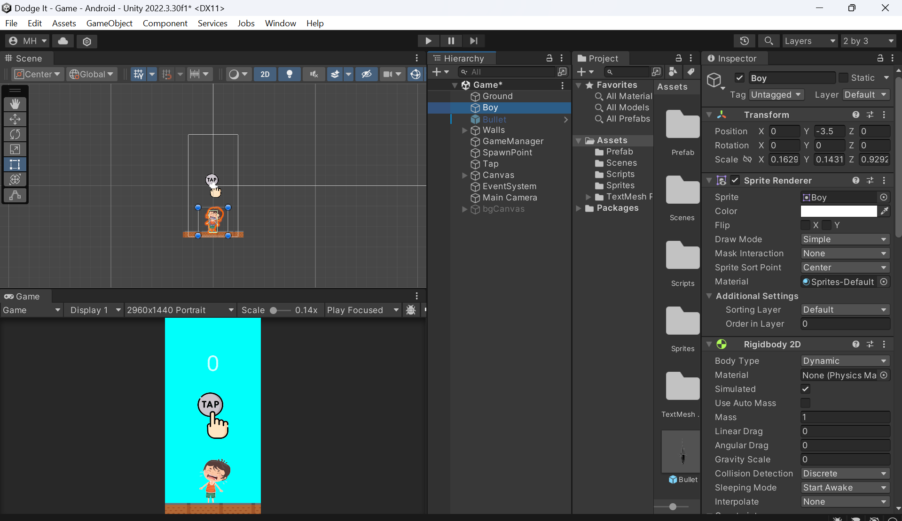
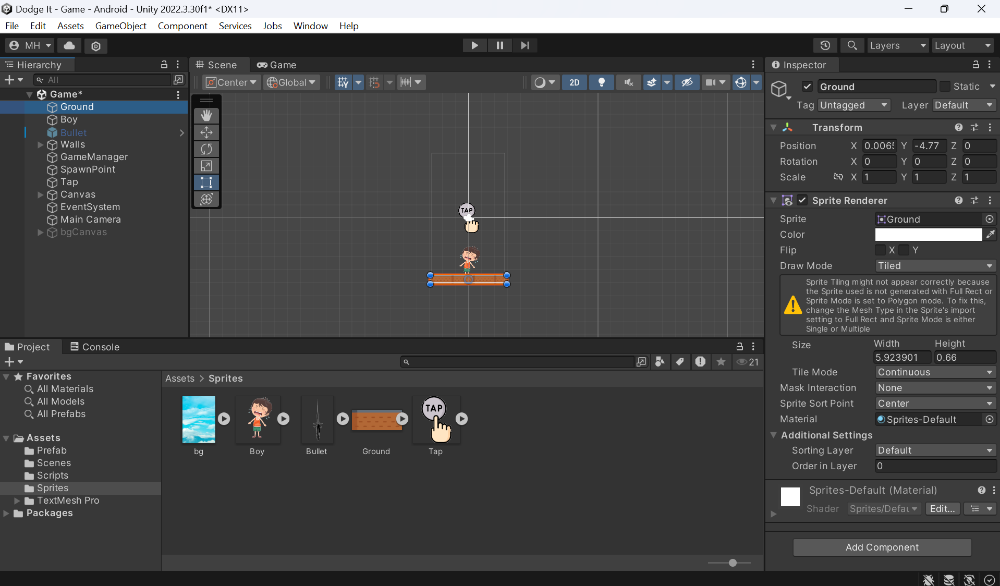
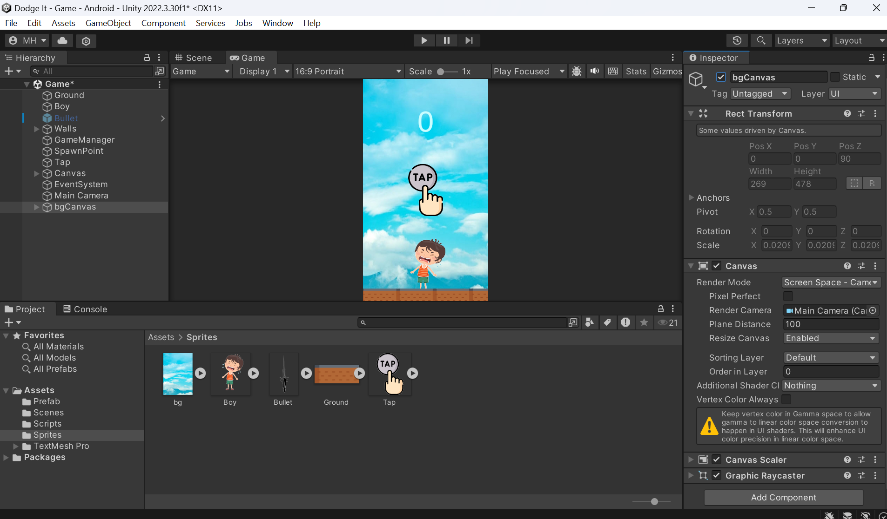

# Exciting-2D-Adventure-Game---Dodge-It

# 🎮 Project Title: Exciting 2D Adventure Game

# 🔗 Project Overview:

I am thrilled to share the development journey of my latest project, a 2D adventure game created using Unity. This game combines intuitive mechanics, engaging gameplay, and immersive graphics to deliver a captivating experience for players of all ages.

# 🚀 Key Features:

Dynamic Character Movement: Implemented smooth and responsive character controls using Unity's Rigidbody2D component. The main character, "Boy," reacts to player inputs for seamless navigation through the game world.

Interactive Environment: Designed an interactive game environment with various obstacles and enemies. The character's interactions with these elements are handled through robust collision detection and response mechanisms.

Engaging Gameplay Mechanics: Developed engaging gameplay mechanics, including block spawning and scoring systems, to keep players motivated and challenged.

Intuitive UI/UX: Created an intuitive user interface using TextMeshPro for clear and visually appealing score display. Implemented touch-based controls for an accessible and enjoyable player experience.

# 🔧 Technical Highlights:

Utilized C# scripting in Unity to handle game logic, player input, and physics-based interactions.

Implemented object pooling techniques for efficient memory management and optimized performance.

Employed coroutines for controlled and flexible gameplay event timing, such as block spawning.

Integrated UI elements to provide real-time feedback and enhance player engagement.

# 🌟 Project Impact:

This project not only demonstrates my technical proficiency in game development but also highlights my ability to create fun and interactive experiences. By focusing on both gameplay mechanics and user experience, I have crafted a game that is both challenging and enjoyable.

# 🔍 Looking Ahead:

I am continuously refining and expanding the game, with plans to introduce new levels, enemies, and power-ups. I am excited about the potential for this project and am eager to share it with a wider audience.

# 💬 Connect with Me:

I am always open to feedback, collaboration opportunities, and discussions about game development. Feel free to connect with me if you're interested in learning more about this project or if you have any insights to share!

# [LinkedIn/Madhesh H](https://www.linkedin.com/in/madheshh/)  
# [LinkedIn/Agilesh Arumugam](https://www.linkedin.com/in/agilesh-arumugam-583186314/)

